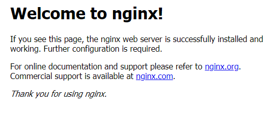

# Full Stack Tutorial

Go to Digital Ocean and create a droplet

If you don't have an account, you can get free 100$ by registering to Digital Ocean via this link: https://m.do.co/c/402f87d0c72e

## 1. Creating the SSH KEY in UBUNTU

Move into .ssh directory

```bash
$ cd ~/.ssh
```

Generate ssh key

```bash
$ ssh-keygen
```

List the files with a regular expression (fsfe2 is my ssh key name)

```bash
$ ls | grep fsfe2
```

ffse2 <- private key

fsfe2.pub <-public key

## SSH into server

```bash
$ ssh root@YOUR_IP
```

If the permission is denied

```bash
$ ssh -i fsfe2 root@YOUR_IP
```

You need to pass the name of the private key to the server. In my case it was "fsfe2"

To debug and get more information use

```bash
$ ssh root@YOUR_IP -v
```

## Activating the keychain

```bash
$ sudo nano ~/.ssh/config
```

Switch this two properties to "yes"

```text
Host *
 AddKeysToAgent yes
 UseKeychain yes
```

## Add private key to keychain

```bash
$ ssh-add -K ~/.ssh/fsfe2
```

## Switching out of root

For example:

root@ubuntu-s-143v-sfo2:~#

"#" means you are on a Root / Super User

You can cheak if you really are the root by typing

```bash
$ whoami
```

# 2. Server Setup

Update software

```bash
$ apt update
```

Upgrade software

```bash
$ apt upgrade
```

Add new user

```bash
$ adduser $USERNAME
```

Add user to "sudo" group

```bash
$ usermod -aG sudo $USERNAME
```

Switch user

```bash
$ su $USERNAME
```

Check sudo access

```bash
$ sudo cat /var/log/auth.log
```

If you want to log the most recent logs from your server you can use

```bash
$ sudo tail -f /var/log/auth.log
```

Change to home directory

```bash
$ cd ~
```

Create a new directory if it doesn't exist

```bash
$ mkdir -p ~/.ssh
```

Create authorized_keys file and paste PUBLIC key

```bash
$ sudo nano ~/.ssh/authorized_keys
```

Exit

```bash
$ exit
$ exit
```

Login with new user

```bash
$ ssh $USERNAME@IP_ADDRESS
```

Change file permissions

```bash
$ sudo chmod 644 ~/.ssh/authorized_keys
```

Disable root login

```bash
$ sudo nano /etc/ssh/sshd_config
```

Change te PermitRootLogin to "no"

Restart ssh daemon

```bash
$ sudo service sshd restart
```

# 3. Nginx

Install nginx

```bash
$ sudo apt install nginx
```

Start nginx

```bash
$ sudo service nginx start
```

If everything is setup correctly, you should be welcomed with this page after you go to your IP_ADRESS



Show nginx configuration

```bash
$ sudo less /etc/nginx/sites-available/default
```

Create and edit index.html

```bash
$ sudo nano /var/www/html/index.html
```

Install NodeJS and npm

```bash
$ sudo apt install nodejs npm
```

Install git

```bash
$ sudo apt install git
```

Change ownership of the www directory to the current user

```bash
$ sudo chown -R $USER:$USER /var/www
```

# 3. Application Setup

Create app directory

```bash
$ mkdir /var/www/app
```

Move into app directory and initialize empty git repo

```bash
$ cd/var/www/app && git init
```

Create directories

```bash
$ mkdir -p ui/js ui/html ui/css
```

Create empty app file

```bash
$ touch app.js
```

Initialize project

```bash
$ npm init
```

Install express

```bash
$ npm i express --save
```

# 4. Proxy Passing Traffic

Edit nginx config

```bash
$ sudo nano /etc/nginx/sites-available/default
```

And change it

```text
 location / {
                $YOUR_IP:3000/;
                ....
        }
```

Restart your nginx

```bash
$ sudo service nginx reload
```

# 5. Process Manager

- Keeps your application running
- Handles errors and restarts
- Can handle logging and clustering

Install PM2

```bash
$ sudo npm i -g pm2
```

Start PM2

```bash
$ pm2 start app.js
```

Setup auto restart

```bash
$ pm2 startup
```
